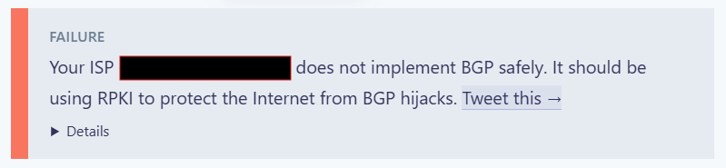
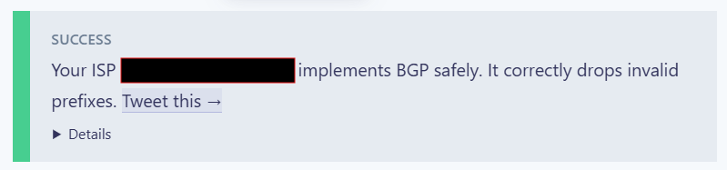

# Is BGP _Really_ Safe Yet?

Some of you might be familiar with the Cloudflare-backed website [isbgpsafeyet.com](https://isbgpsafeyet.com). But have you ever wondered _how_ this website is assessing the BGP safety of the network you're accessing it from? I certainly did, and the result was rather interesting...

<!-- more -->

# How does it work?

First we need to figure out how this website works and decides if BGP on your website is safe or not. They don't actually bother to explain this anywhere, and searching for it doesn't really return any super useful results.

So our two options really are to look at the source-code for the website, which we can either directly do in the browser dev-console or in Cloudflare's [GitHub Repo](https://github.com/cloudflare/isbgpsafeyet.com).

Immediately what catches my attention when looking at the source is this Javascript:

```js title="/src/js/index.js"
const successMessageDetails = `${""}fetch https://valid.rpki.isbgpsafeyet.com
  <i pass><i>${svgCheck}</i></i>correctly accepted valid prefixes

fetch https://invalid.rpki.isbgpsafeyet.com
  <i pass><i>${svgCheck}</i></i>correctly rejected invalid prefixes`;

const failureMessageDetails = `${""}fetch https://valid.rpki.isbgpsafeyet.com
  <i pass><i>${svgCheck}</i></i>correctly accepted valid prefixes

fetch https://invalid.rpki.isbgpsafeyet.com
  <i fail><i>${svgTimes}</i></i>incorrectly accepted invalid prefixes`;
```

That's odd, this seems _way_ too simple to actually be doing any actual verification of BGP right?

---

# Digging Further

The URLs this Javascript is fetching don't return any particularly useful data - just some JSON fields as you'll see later in the article, and effectively it's just a boolean "depending on which URL works, BGP is or isn't safe". But I thought surely I had gotten it wrong and that [isbgpsafeyet.com](https://isbgpsafeyet.com) wasn't this shallow.

Well, let's dig a bit further and find out.

!!! note "Cloudflare and MANRS"

    Cloudflare is a member of the [**MANRS**](https://manrs.org/participant/144/) initiative, and quite a high level one - in particular their membership states that they meet the following standards:

    - **Action 1: Prevent propagation of incorrect routing information**
    - Action 2: Prevent traffic with spoofed source IP addresses
    - Action 3: Facilitate global operational communication and coordination
    - **Action 4: Facilitate validation of routing information on a global scale**
    - Action 5: Encourage MANRS adoption
    - Action 6: Provide monitoring and debugging tools to the peering partners

Since we've somewhat deduced the logic of the JavaScript already (whether it receives a response from a certain URL), let's see what IP's they're resolving to.

```bash title="valid.rpki.isbgpsafeyet.com"
jacob@cobloaf:~$ dig +short valid.rpki.isbgpsafeyet.com a
valid.rpki.cloudflare.com.
104.17.230.6
104.17.231.6
jacob@cobloaf:~$ dig +short valid.rpki.isbgpsafeyet.com aaaa
valid.rpki.cloudflare.com.
2606:4700::6811:e706
2606:4700::6811:e606
```

```bash title="invalid.rpki.isbgpsafeyet.com"
jacob@cobloaf:~$ dig +short invalid.rpki.isbgpsafeyet.com a
invalid.rpki.cloudflare.com.
103.21.244.9
103.21.244.8
jacob@cobloaf:~$ dig +short invalid.rpki.isbgpsafeyet.com aaaa
invalid.rpki.cloudflare.com.
2606:4700:7000::6715:f408
2606:4700:7000::6715:f409
```

Simple enough - for now we'll just focus on the IPv4 addresses to keep things short.

So what happens when we `traceroute` and `cURL` the URLs from a test machine?

```bash
jacob@cobloaf:~$ traceroute -4 valid.rpki.isbgpsafeyet.com
traceroute to valid.rpki.isbgpsafeyet.com (104.17.230.6), 30 hops max, 60 byte packets
 ...
 2  as13335.per.edgeix.net.au (103.136.102.17)  1.303 ms  1.331 ms *
 3  104.17.230.6 (104.17.230.6)  0.777 ms  0.760 ms  0.675 ms

jacob@cobloaf:~$ traceroute -4 invalid.rpki.isbgpsafeyet.com
traceroute to invalid.rpki.isbgpsafeyet.com (103.21.244.8), 30 hops max, 60 byte packets
 ...
 2  as13335.per.edgeix.net.au (103.136.102.17)  1.574 ms  1.599 ms  1.571 ms
 3  103.21.244.8 (103.21.244.8)  0.848 ms  0.762 ms  0.814 ms

jacob@cobloaf:~$ curl -4 https://valid.rpki.isbgpsafeyet.com
{"status":"valid","asn":[redacted],"name":"[redacted]","blackholed":false}

jacob@cobloaf:~$ curl -4 https://invalid.rpki.isbgpsafeyet.com
{"status":"valid","asn":[redacted],"name":"[redacted]","blackholed":false}
```

Both URLs work. Visiting the website shows that "BGP Isn't Safe Yet"



Well, what happens if one of them doesn't work anymore? That's pretty easy to test, let's try blocking `invalid.rpki.isbgpsafeyet.com`.

```bash
jacob@cobloaf:~$ sudo firewall-cmd --add-rich-rule="rule family=ipv4 destination address=103.21.244.8 reject"
jacob@cobloaf:~$ sudo firewall-cmd --add-rich-rule="rule family=ipv4 destination address=103.21.244.9 reject"
```

Now let's try it again!



... well then.

---

# BGP Is Safe Now!

!!! danger "Nuclear Level of Sarcasm"

    Wow, we've fixed BGP with a `firewall-cmd` command, perfect!!!

So what have we actually just done?

On the network these tests were run from, RPKI Signing is indeed not enforced - however it does implement IRR-based prefix filtering, prefix limits and signs it's own originated routes with RPKI.

The network is receiving a route to `103.21.244.0/24` over Bilateral Peering Sessions with AS13335(Cloudflare). It goes without saying that the general peering policy of any network is that IRR records should be accurate and regularly maintained, and indeed this is part of **MANRS**. However it looks like Cloudflare are not only intentionally advertising an unsigned prefix, but they're also declaring it as a valid route in their IRR records that have long been the defacto standard for ensuring only valid prefixes are accepted from a peer.

We know that the `AS-SET` that Cloudflare have declared as representing valid prefixes for BGP peers to accept from them is `AS13335:AS-CLOUDFLARE` based on their [PeeringDB](https://as13335.peeringdb.com) entry.

We can query the prefixes in the `AS-SET` with `bgpq4`, as below

```bash title="bgpq4"
jacob@cobloaf:~$ bgpq4 AS13335:AS-CLOUDFLARE -F %n/%l\\n | grep 103.21.244
103.21.244.0/22
```

As you can see, Cloudflare state that `103.21.244.0/22` is a valid network that all peers should be accepting from their network.

---

# Conclusion

So my tone in this article may indicate to you that I have a problem with what Cloudflare is doing here - and you would be right to think so.

- Am I against RPKI Signing? _Certainly not._
- Am I unhappy that Cloudflare is intentionally breaching known peering conventions to manufacture outrage amongst users about RPKI, many of whom don't know any better? _A little bit._

But really my problem is that a website called [isbgpsafeyet.com](https://isbgpsafeyet.com) will tell anyone in the world that any BGP AS is safe as long as it blocks or filters two Cloudflare IPv4 / IPv6 Addresses, whilst failing to explain how the tool is working and what other methods of security Cloudflare are intentionally circumventing in the process to facilitate the functionality of the tool.

At best, it is rather disingenuous in my opinion.

So, Is BGP _Really_ Safe Yet just because Cloudflare say it is? :smile:
