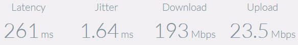
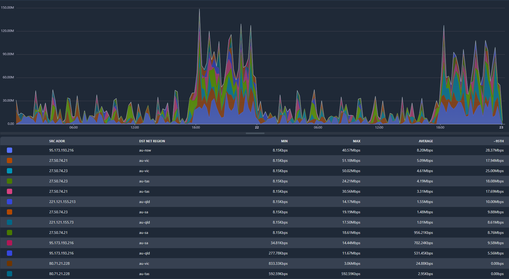
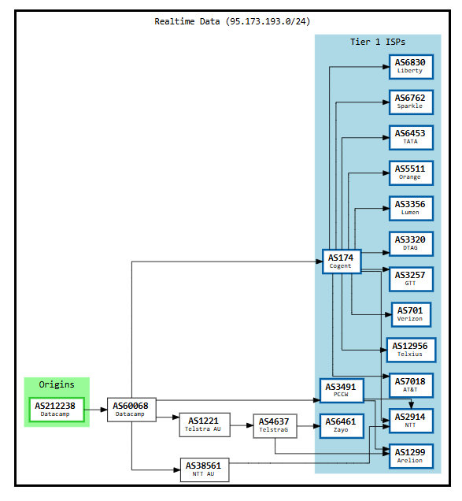

# ACCC Measuring Broadband Reports: Measuring what?

For the international readers, the [ACCC](https://accc.gov.au) (Australian Competition and Consumer Commission) is a Consumer Protection focused regulatory body at the level of Federal Government in Australia. In 2018, they began publishing reports related to comparing performance between various Retail Service Providers (or ISPs) on the nbn (National Broadband Network) and other fixed-line customer access networks in Australia. The ACCC has contracted SamKnows (owned by Cisco) to orchestrate the testing and collection of data that is used to produce these reports, SamKnows performs these tests by selectively distributing a testing device to Australian internet users on an opt-in basis and having them plug the device into their local network at home.

Within Australia these reports have a questionable reputation at best amongst the Network Engineering community, we'll explore why this is so in this post.

<!-- more -->

# What's Wrong with this Program?

The first area that the ACCC's [Measuring Broadband](https://measuringbroadbandaustralia.com.au/) program falls flat, is that they don't actually publish a technical testing methodology nor actually describe in any detail what is being measured, how they are measuring it or how SamKnows compensate for errors that are not indicative of a fault on the targeted RSP's network. Whilst it's possible to infer the way it works by looking into the SamKnows speedtest website, the SamKnows measurement boxes that are planted at random houses could be performing any manner of measurements, and it will be necessary to acquire one physically and attempt to dig into the guts of it to investigate how they work in more detail.

The ACCC do publish some performative fluff in their [Broadband Performance Data Explained](https://www.accc.gov.au/consumers/telecommunications-and-internet/broadband-performance-data/broadband-performance-data-explained) article, and of particular interest they explicitly state that the data is accurate and independent (which will also be examined in this article). It is unfortunate that this article simply suggests to RSPs to "resolve network issues" or upgrade customers to higher speed tiers as a solution to negative test results, rather than providing information that would allow RSPs to identify and resolve issues. These test results have a considerable impact on brand reputation, and may be particularly challenging for smaller RSPs to navigate and market around.

There is also no disclosure as to who actually operates the networks that the testing infrastructure is using, nor is there any information that discloses known outages or service impacts that affected the availability or performance of the test service itself.

Finally, there is no binding agreement which RSPs enter into that legally prevents them from interfering with the results of these tests. This means that it's possible (and very easy) to implement network policies that prioritise traffic to and from SamKnows test nodes to artificially inflate the test results. However, there might actually be some good reasons for certain RSPs to be doing this, due to the way SamKnows Australian infrastructure is hosted.

So in summary, there's 4 outstanding issues that will be addressed in this article:

- [Accuracy](#accuracy) of the data reported
- [Independence](#independence) of the testing
- [Disclosure](#disclosure) by the ACCC
- [Authenticity](#authenticity) of test data

Lastly, a fifth point would be getting a more in-depth understanding of how the test boxes work and operate, but that will need to be visited in another article as we don't have one to dig into at the time of writing.

# Accuracy

!!! information

    The remainder of this article will be focusing on the [SamKnows Speedtest](https://speedtest.samknows.one) service when referring to SamKnows. In a future article we will explore the functionality of the SamKnows test boxes.

First up is accuracy of the testing that SamKnows is performing.

The first thing a speedtest service needs to do well is to detect the location the test is being run from accurately, so it can be tested from an appropriate test server. For the purposes of evaluating an RSP network there is little point in testing a path that spans infrastructure halfway across the globe owned and operated by dozens of different companies, as it introduces a huge number of uncontrollable variables that the RSP often has little to no control over.

Let's run a test from a 250/25 service located in Victoria, Australia.



261ms is quite high, digging into the Developer Console of the browser while the test is running shows that the test is primarily communicating with a server at `n21-the1.samknows.com`.

With a bit more digging done by some colleagues, a very well educated guess indicates that this server is located in "Telehouse North", a datacenter based in England, UK.

Now already, this isn't really acceptable. SamKnows have extensive Speedtest infrastructure in Australia, and the geo-location information for the network this test was run from is published in accordance with [RFC8805](https://www.rfc-editor.org/rfc/rfc8805.html), is searchable in accordance with [RFC9632](https://www.rfc-editor.org/rfc/rfc9632.html) and is correct in all major geo-location databases. This brings into question; how much of the Measuring Broadband test data might be derived from tests performed against poorly geo-located test servers?

SamKnows do not offer a way to manually select the correct region to perform the test in, and whilst it is likely possible to force a particular server to be used with some editing tricks in the browser's Developer Console, the speedtest client itself (served via webpack at `webpack:///~/@samknows/web-sdk/dist/speedtest.js` and various other scripts that feed it configuration information) is comprised of heavily obfuscated code that is non-trivial to reverse-engineer.

However, there are easier ways to determine the possible list of servers they offer to test requests in Australia which I won't go into in this article. The list below is not exhaustive but is reasonably comprehensive:

```bash
n2-accc-sydney-au.samknows.com (95.173.193.216) # New South Wales, Datacamp AS212238 (ACCC, Interesting!)
n2-udp-global-sydney-au.samknows.com (95.173.193.216) # New South Wales, Datacamp AS212238
n5-brisbane-au.samknows.com (221.121.155.73) # Queensland, Servers Australia AS45671
n7-brisbane-au.samknows.com (221.121.155.213) # Queensland, Servers Australia AS45671
n5-perth-au.samknows.com (43.250.205.173) # Western Australia, Servers Australia AS45671
n6-perth-au.samknows.com (43.250.205.175) # Western Australia, Servers Australia AS45671
n7-melbourne-au.samknows.com (27.50.74.21) # Victoria, Servers Australia AS45671
n8-melbourne-au.samknows.com (27.50.74.23) # Victoria, Servers Australia AS45671
n21-the1.samknows.com (80.71.21.228) # Telehouse North (England), Syntura AS39326
n22-the1.samknows.com (80.71.21.229) # Telehouse North (England), Syntura AS39326
```

Running a `cURL` against all of these servers returns the same response:

```html
...
<h2>This is a SamKnows testnode.</h2>
...
```

With this list it's possible to do some flow-data analysis and see what regions within an RSP network are being served by which test servers.

We could also conclude that the ACCC decided that Adelaide (South Australia), Darwin (Northern Territory) and Hobart (Tasmania) were unnecessary places to have testing infrastructure located. For international readers, it is fairly typical of the federal government to neglect these areas and in some ways it is surprising to see that Perth (Western Australia) has speedtest servers.



!!! note

    Noting the utilisation pattern in the graphs above, the [Measuring Broadband landing page](https://measuringbroadbandaustralia.com.au) states that the automated speed testing occurs only whilst the user's internet connection isn't in use, yet there is very clearly a large uptick in testing activity during the peak usage hours of 6PM to 12AM UTC+11. These could be manual tests, but the regularity of the pattern seems too coincidental for this to be the case.

Based on this flow-data, we can come up with the following matrix (vertical axis being a list of Speedtest server regions, horizontal axis being a list of customer regions) of which speedtest servers have served which regions within our network over the last 48 hours. Western Australia and Northern Territory have been omitted from the results, as no flow-data has been collected in that time period for any tests served from WA test servers nor to WA or NT customers on this network from the list of hosts above.

| **Speedtest Server Region** | **Queensland** | **New South Wales** | **Victoria**   | **Tasmania**   | **South Australia** |
| --------------------------: | -------------- | ------------------- | -------------- | -------------- | ------------------- |
|              **Queensland** | :green_circle: | :red_square:        | :red_square:   | :red_square:   | :red_square:        |
|         **New South Wales** | :green_circle: | :green_circle:      | :red_square:   | :red_square:   | :green_circle:      |
|                **Victoria** | :red_square:   | :red_square:        | :green_circle: | :green_circle: | :green_circle:      |
|                 **England** | :red_square:   | :red_square:        | :green_circle: | :green_circle: | :red_square:        |

One important thing that is unable to be verified at this point in time is which servers are and are not used by the SamKnows test boxes. In the flow-data above, the designated "ACCC" server in Sydney is clearly the largest single source of test traffic on this network, but it's not possible to determine if it is the only server used in the Measuring Broadband program from this data alone.

The only reasonable conclusion to come to here is that Measuring Broadband reports are potentially based on some seriously compromised and misrepresented data-sets.

In particular:

- Providing test servers in only 4 out of 8 mainland Australian states and territories, two of which (Northern Territory and Tasmania) have a well earned reputation for being difficult and expensive to maintain good and reliable connectivity to from the rest of the country, is a failure that in a-lot of cases is not indicative of an RSP failing to correctly operate a network or provide a good quality service in those regions. It is fair to say that these regions suffer from a lack of ~~Senators and Members of Parliament~~ infrastructure investment.
- In the case of nbn, most outages occur within the nbn network itself and they often do not affect all RSPs equally. nbn also (in my anecdotal experience) have a reputation for mis-reporting or denying the occurrence of some outages entirely, and it becomes even more of a contentious issue when it comes down to issues on the nbn network that impact service performance rather than causing a service outage. There is no indication from the ACCC as to whether the Measuring Broadband reports are integrated with outage or incident information from nbn or not.
- The serving of tests from the UK which may be happening at random will massively skew any results pertaining to jitter and packet-loss, and inherently will record lower download speeds due to the effect of latency on TCP-based speed-testing.
- There's no information pertaining to who is responsible for the outages being recorded, nor what actually even constitutes an outage, but they are statistics being attributed to RSPs in the report anyway. It is very likely that infrastructure damage caused by Tropical Cyclone Alfred in Queensland and New South Wales will be attributed as outages towards RSPs in the Measuring Broadband report that covers the March 2025 testing period. If the outage data is excluded for the reporting period, it is indicative that the data for attributing correct blame for an outage just hasn't been getting collected in the first place.

There are further issues that could be raised on this topic, but the point has been well established at this stage so let's move on to the next point.

# Independence

SamKnows is stated to be an independent party responsible for running the testing that collects the data for the Measuring Broadband program. It is worth pointing out that SamKnows is owned by Cisco, whom have various significant commercial agreements with Telstra (Australia's largest telco and RSP) and a number of other Australian RSPs.

But SamKnows itself is essentially just a software product, neither they nor Cisco own or operate any of the actual infrastructure that the service is run on (more on that in [Disclosure](#disclosure)).

SamKnows as a product appears to have largely been borged into [ThousandEyes](https://www.thousandeyes.com/), another black-box product used for measuring and monitoring network performance. The [SamKnows One](https://samknows.one) portal remains available but with no sign-up button and instead a slightly smoke-and-mirrors message for those who wish to sign-up. Due to the proprietary nature of the software behind SamKnows and ThousandEyes, I believe it is unlikely that the testing methodology being used to generate the Measuring Broadband reports will be able to be revealed due to various legal and commercial restrictions.

As far as the infrastructure that SamKnows is operating on within Australia is concerned, they utilise the following providers:

- CDN77 (Datacamp)
- AWS (Amazon)
- SAU (Servers Australia)

On the surface, SamKnows seems to be reasonably independent as a test operator.

# Disclosure

I will get straight to the point here, the ACCC has a disclosure problem with the Measuring Broadband reports.

The biggest failure in terms of disclosure is related to CDN77 / Datacamp, which in the flow-data above we have seen is serving a _significant_ ratio of the testing traffic, and even has a specifically labelled ACCC test server.

The SamKnows test servers that Datacamp host sit in AS212238 (Datacamp), whose only upstream AS is AS60068 (CDN77). The `95.173.193.0/24` prefix that the `n2-accc-sydney-au.samknows.com` speedtest server is located in is peered on Sydney-based Internet Exchanges ([EdgeIX Sydney](https://edgeix.net.au), [MegaIX Sydney](https://megaport.com), and [EquinixIX Sydney](https://equinix.com)), however it is not peered in any other city. This means that if you are a small Queensland or South Australian based RSP (two areas that the flow-data earlier in the article proved that this server was serving tests to) with no network presence in Sydney, your tests will have to be delivered by IP Transit.

Let's look at CDN77's IP Transit providers that provide a route to `95.173.193.0/24` (courtesy of [BGP Tools](https://bgp.tools)):



AS60068 Upstream's are as follows:

- AS174 (Cogent)
- AS3491 (PCCW)
- AS38561 (NTT)
- **AS1221 (Telstra)**

Telstra by far have the most domestic IP Transit capacity and capability of all four of the above providers. They are also literally a competitor to every single RSP that could possibly appear in the Measuring Broadband report, and are being left responsible for _delivering their own competitor's test traffic_ in certain scenarios. I have not been able to find a single mention or disclosure of this conflict of interest anywhere in the ACCCs information about the reports.

It absolutely needs to be said that it's imperative that a program of this nature be run in a carrier-neutral way to be worthy of credibility, and that the onus of being carrier-neutral lies with the test operator, not the test subjects.

# Authenticity

Getting straight to the point here as-well, it's easy for an RSP to fudge their Measuring Broadband results. All it takes is a Quality of Service policy that prioritises traffic to and from the SamKnows test servers over other traffic. The RSP could have backhaul links to an nbn POI that are being maxed out, but this won't be reflected in the tests as the traffic is being prioritised on the congested link.

On the flip-side, an RSP might be justified in prioritising SamKnows traffic, as a customer who heavily utilises their connection may ultimately be dragging the test results down by competing for bandwidth or other resources that the SamKnows box needs for testing. When there's the possibility of your test traffic being delivered by a competitor, one also couldn't blame RSP's for wanting to give the tests every opportunity to be as good as they could be.

It's also easy for a bad actor (or a bad customer router!) to hamper the performance of the SamKnows box, as it sits _behind_ the customer router and is beholden to any QoS policies it may be imposing as-well, potentially poisoning the results.

# Conclusion

The ACCC Measuring Broadband program is flawed, pointing users to geographically inappropriate test servers, lacking in information that allows RSPs to improve their services, has some serious conflicts of interest and suffers from a data-integrity problem in that SamKnows has no real way to identify if the data being collected is authentic and free from interference or truly reflective of user experience.

The data being presented by the ACCC in these reports has a real effect on the reputation of the RSP's contained within them. RSP's may find themselves needing to invest in marketing to reverse the negative reputation they may gain from these unreliable reports, money that we could all agree would be better spent on improving the network and service instead.

What are you thoughts?
